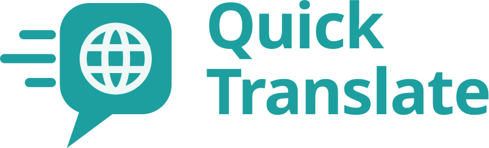

<br>
<br>

<p align="center">
	
</p>

<br>

<p align="center">
	<a href="https://www.apache.org/licenses/LICENSE-2.0">
		
	</a>
	<a href="https://go.dev">
		
	</a>
	<a href="https://vuejs.org">
		
	</a>
</p>

# Quick Translate

Quick Translate translates your selected text, triggered by a global shortcut. It runs hidden in the background and shows a small popup with the translation.

> [!WARNING]
> **Quick Translate is in alpha.** It works, but has seen little use outside its own development, and the configuration format may change without a migration path.
>
> - **Supported:** Linux on any freedesktop-compliant desktop, with extra integration for KDE Plasma.
> - **Not yet supported:** macOS and Windows.
>
> Problems are welcome as [GitHub issues](https://github.com/manuelschoene/quick-translate/issues/new/choose).

## Requirements

Quick Translate needs **WebKitGTK 6.0** and **GTK 4.10 or newer**, which means Ubuntu 24.04, Debian 13 or newer, or a current Fedora or Arch. It does not start without them, not even for its command-line options.

It also needs a clipboard tool: `wl-clipboard` in a Wayland session, `xclip` or `xsel` in an X11 session.

| Package   | Debian / Ubuntu      | Fedora            | Arch              |
|-----------|----------------------|-------------------|-------------------|
| WebKitGTK | `libwebkitgtk-6.0-4` | `webkitgtk6.0`    | `webkitgtk-6.0`   |
| Wayland   | `wl-clipboard`       | `wl-clipboard`    | `wl-clipboard`    |
| X11       | `xclip` or `xsel`    | `xclip` or `xsel` | `xclip` or `xsel` |

## Installation

### From a release

Download the archive and `SHA256SUMS` from the [releases page](https://github.com/manuelschoene/quick-translate/releases), then:

```sh
sha256sum --check --ignore-missing SHA256SUMS
tar -xzf quick-translate-*-linux-amd64.tar.gz
cd quick-translate-*-linux-amd64
install -D -m 0755 bin/quick-translate ~/.local/bin/quick-translate
cp -r share ~/.local/
```

`share/` holds the desktop entry and the icon, both named `io.github.manuelschoene.QuickTranslate`. **Do not rename them:** your desktop grants the global shortcut to the application this name identifies.

### From source

`main` is the development state. For a released version, check out its tag first (`git checkout v0.1.0-alpha`).

Build requirements, besides the packages above:

- **Go** >= 1.26.8 and **Bun** >= 1.3.14
- **gcc** and **pkgconf**, for the cgo bindings to GTK and WebKit
- The development packages of **GTK4** and **WebKitGTK 6.0** (`libgtk-4-dev libwebkitgtk-6.0-dev` on Debian and Ubuntu)
- **UPX** >= 5.2.0, which compresses release builds. `DEV=true` or `UPX=false` skip it.
- The **Wails CLI** at the version in `go.mod`, and **Task**:

```sh
go install github.com/wailsapp/wails/v3/cmd/wails3@v3.0.0-beta.23
go install github.com/go-task/task/v3/cmd/task@latest
```

Then build the archive a release ships and install it as described above, from inside `bin/`:

```sh
task archive      # -> bin/quick-translate-<version>-linux-amd64.tar.gz
```

`task --list` shows every other task.

## Usage

After installation, the application must be started manually. The first start registers the application to start with your session, because the shortcut only works while it runs.

Select some text and press **Super+Shift+T** (KDE Plasma calls the key *Meta*). Under Wayland, your desktop asks once whether to grant the shortcut and lets you change it.

While it runs, a tray icon opens the last translation, translates the selection or quits. KDE Plasma shows the icon out of the box, GNOME needs the AppIndicator extension.

On Linux, the text is read from the *primary selection* (whatever is marked with the mouse), and the translation is written to the regular clipboard, ready for <kbd>Ctrl</kbd>+<kbd>V</kbd>.

The binary also answers a few commands:

```sh
quick-translate --help      # every command
quick-translate --status    # what is installed where
quick-translate --version   # which build this is
```

## Configuration

The configuration lives in `~/.config/quick-translate/config.yml` and is created with a commented template on the first start.

| Key                                    | Meaning                                                                                          |
|----------------------------------------|--------------------------------------------------------------------------------------------------|
| `language_preferences.source`/`target` | BCP 47 tags such as `en` or `de`. Empty source means detection, empty target the system locale. |
| `history.max_entries`                  | How many translations to keep. `0` turns the history off. Default `100`.                         |
| `default_provider`                     | The provider used on startup, e.g. `deepl`.                                                      |
| `provider.<slug>`                      | The settings of each provider, see below.                                                        |

### DeepL

DeepL supports automatic source language detection and both the free and the paid API.

To get an auth key, sign in at [deepl.com](https://deepl.com), choose an API plan (the free one is enough for most people), and create a key under **Account → API Keys & Limits**. Quick Translate only needs the *Translate text* and *Retrieve languages and resources* permissions.

| Option         | Required | Meaning                                                                                                                                                  |
|----------------|----------|----------------------------------------------------------------------------------------------------------------------------------------------------------|
| `auth_key`     | yes      | Your DeepL auth key.                                                                                                                                     |
| `free_version` | yes      | `true` for the free API, `false` for the paid one.                                                                                                       |
| `fast_mode`    | no       | `true` uses DeepL's latency-optimized models. Default `false`.                                                                                           |
| `formality`    | no       | `formal`, `informal` or `default` (the default). [Not every language supports it.](https://developers.deepl.com/api-reference/translate#param-formality) |

```yaml
default_provider: deepl
provider:
  deepl:
    auth_key: YOUR_DEEPL_AUTH_KEY
    free_version: true
```

## Uninstalling

Quit Quick Translate first. To remove everything it wrote for you (configuration, history, cache, autostart entry and KWin rules), run the purge while the binary is still there. It lists what it removes and asks first:

```sh
quick-translate --purge
```

> [!CAUTION]
> Purging cannot be undone. Your history and your configuration, auth keys included, are gone for good.

Then remove the installed files:

```sh
rm ~/.local/bin/quick-translate
rm ~/.local/share/applications/io.github.manuelschoene.QuickTranslate.desktop
rm ~/.local/share/icons/hicolor/scalable/apps/io.github.manuelschoene.QuickTranslate.svg
```

Skipping the purge keeps your configuration and history for a later reinstall.

## Known issues

### Window decorations and placement

The popup asks for no title bar, to stay on top and to open centered. Under Wayland, the compositor decides whether it honors that, so depending on your desktop the popup may:

- get a title bar or border,
- show up in the task bar or the window switcher,
- open somewhere other than the center of the screen.

**KDE Plasma:** on every start, the application merges a window rule into `~/.config/kwinrulesrc` that removes the border, keeps the popup on top and hides it from the task bar, the pager and the window switcher. Your own rules are left untouched, and `quick-translate --purge` removes the rule again.

**Other desktops** get no such rule yet. If the popup looks wrong on yours, please [open an issue](https://github.com/manuelschoene/quick-translate/issues/new/choose) with your desktop and session type.

## Contributing

Contributions and bug reports are welcome. Please read [CONTRIBUTING.md](CONTRIBUTING.md) first. For security problems, see [SECURITY.md](SECURITY.md), which also describes what the application does with your data. Everyone taking part is expected to follow the [Code of Conduct](CODE_OF_CONDUCT.md).

## License

Apache License 2.0, see [LICENSE](LICENSE).
